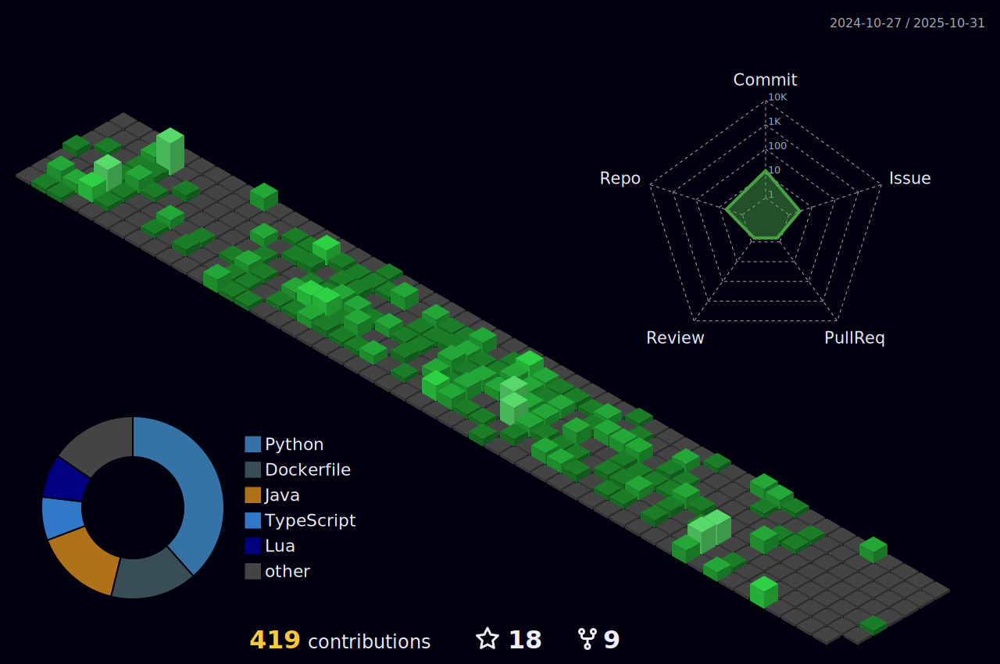

<h1> Hello Fellow < Developers/ >!  </h1>

Hello, world! 🌎 I'm [Dipesh Singh](https://github.com/dipeshsingh253/), a coding enthusiast and lifelong learner 🚀.

From building interactive websites that tell stories 📖, to tinkering with algorithms like a digital puzzle solver 🧩, I find joy in the art of coding. Exploring the realms of data science, web development, and beyond, I believe that every line of code has the potential to shape the future 🌟.

Let's create something extraordinary, one line of code at a time!

 

## 💫 More about Me:

 - 🔭 &nbsp; I’m currently working on  
 - 🌱 &nbsp; I’m currently learning Angular  
 - 💻 &nbsp; All of my projects are available at   
 - ❓ &nbsp; Ask me about anything related to Programming, DSA and Linux  
 - ⚡ &nbsp; Fun fact: HTML is not a programming language  
 - 📧 &nbsp; Want to connect with me ? 

 

## My Absolute Favorites:

- 💻 &nbsp; I love exploring new tech stack and building cool stuffs.
- 🐧 &nbsp; Breaking my setup and rebuilding it whenever possible. Linux is quite fun !!!
- 🍕 &nbsp; Hackathons, meetups & tech events.

 

## 🔨 Languages and Tools:

 
 
 
 

 
 
 
 
 
 
<!--
## 💻 Tech Stack:

 
 
 
 
 
 
 

 
 
 

 
-->

 

## 

 
 
 

 

   
   
 

 

 

##

<!--
## अद्यतनकल्पना श्वः यथार्थः एव

"अद्यतनकल्पना श्वः यथार्थः एव" translates to "Today's imagination is tomorrow's reality" in Sanskrit. Embrace your visions and turn them into the truth of tomorrow.

-->
